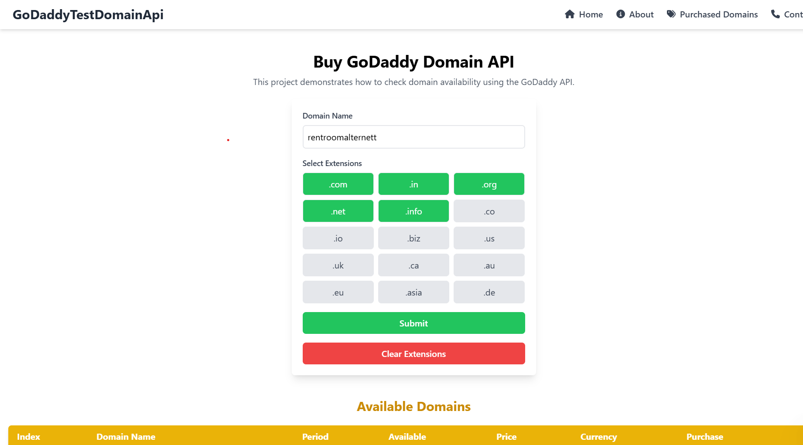
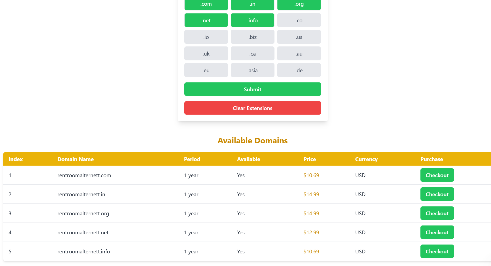
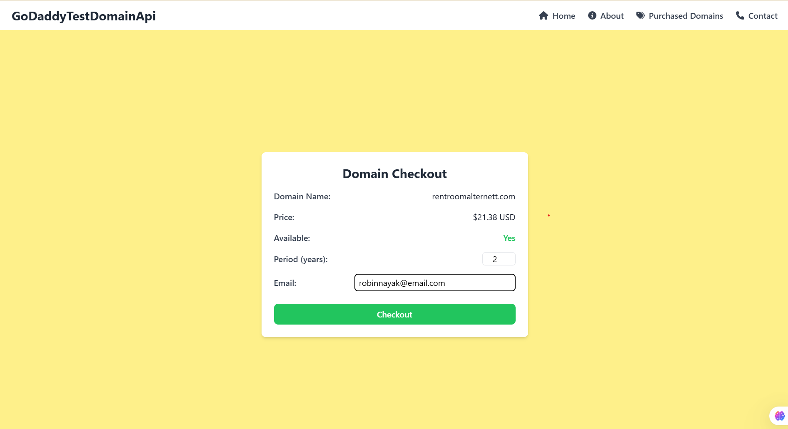
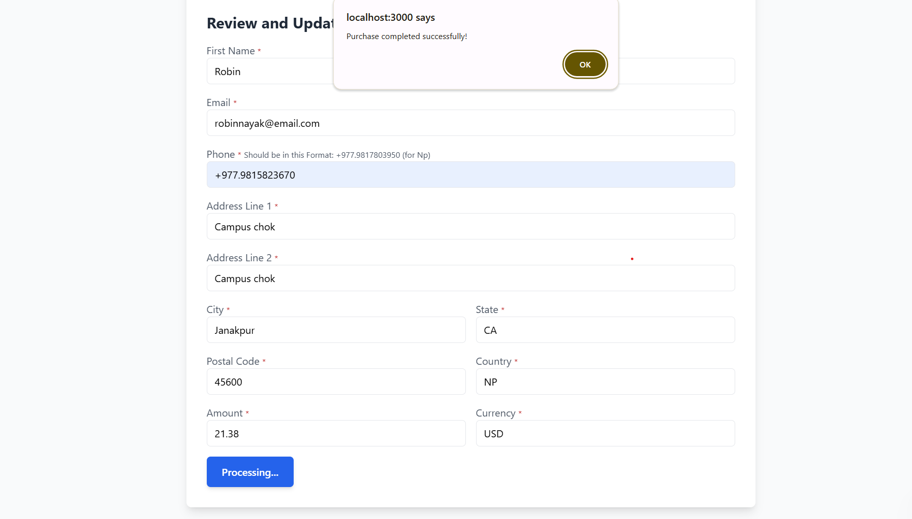
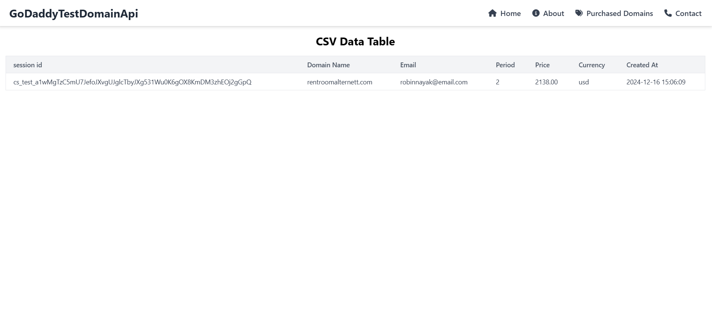
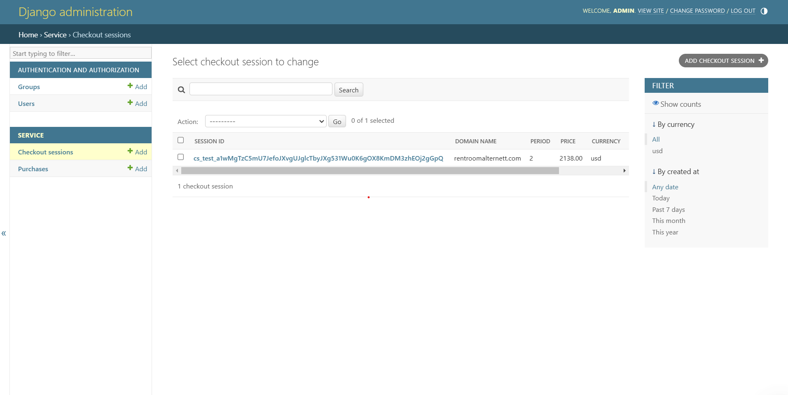
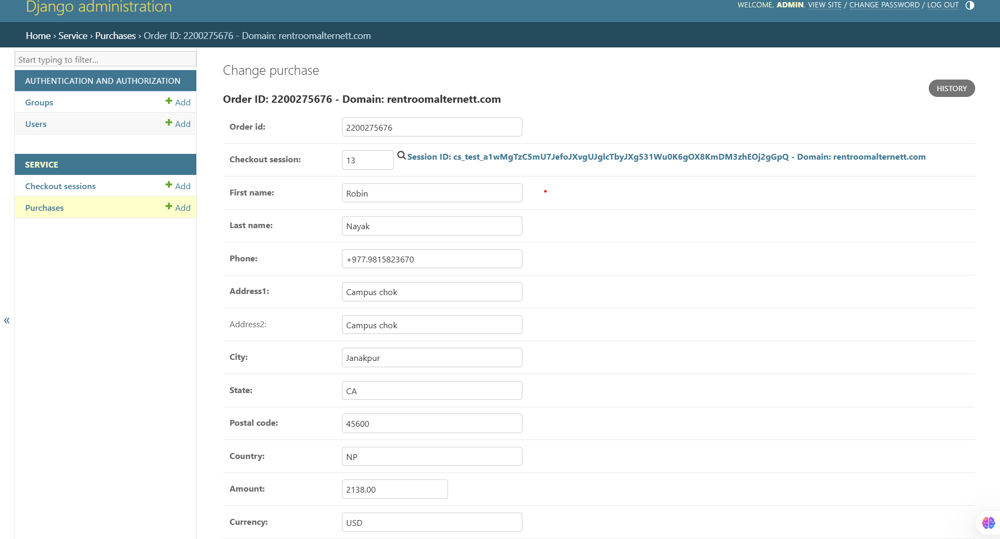

# Domain Name Purchase Website

This project is a full-stack web application that allows users to search, purchase, and manage domain names using the GoDaddy API and Stripe payment gateway. The backend is built using Django, and the frontend is developed with React.js. Below is the documentation to set up, run, and use the project.

---

## Features

- Users can search for available domain names.
- Integration with GoDaddy API for domain registration and management.
- Secure payments via Stripe.
- Domain purchase history and details.
- User-friendly interface built with React.js.

---

## Prerequisites

- Python 3.8+
- Node.js and npm
- Postman (for API testing)
- Virtual environment for Python (recommended)

---

## Backend Setup

### Installation Steps:

1. Clone the repository for the backend:

   ```bash
   git clone https://github.com/robinnayak/your-backend-repo.git
   cd your-backend-repo
   ```

2. Create and activate a virtual environment:

   ```bash
   python -m venv env
   source env/bin/activate  # On Windows: env\Scripts\activate
   ```

3. Install dependencies:

   ```bash
   pip install -r requirements.txt
   ```

4. Create a `.env` file in the root directory with the following structure:

   ```env
   GODADDY_API_KEY=your_godaddy_api_key
   GODADDY_API_SECRET_KEY=your_godaddy_api_secret_key
   STRIPE_SECRET_KEY=your_stripe_secret_key
   WEBHOOK_ENDPOINT_SECRET=your_webhook_endpoint_secret
   ```

   Replace the placeholders with your own keys.

5. Apply migrations and start the server:

   ```bash
   python manage.py migrate
   python manage.py runserver
   ```

   The backend will be available at `http://localhost:8000/`.

---

**Home Check Available Domain:**




**Checkout By Stripe Payment:**



**Purchase Domain:**



**CSV Format:**



**Django DataBase :**





## Frontend Setup

### Installation Steps:

1. Clone the React.js frontend repository:

   ```bash
   git clone https://github.com/robinnayak/eyon-Domain-frontent.git
   cd eyon-Domain-frontent
   ```

2. Install dependencies:

   ```bash
   npm install
   ```

3. Start the development server:

   ```bash
   npm start
   ```

   The frontend will be available at `http://localhost:3000/`.

## API Endpoints

Here is a list of key API endpoints tested with Postman:

### **Checkout Session**

- **Endpoint:** `POST /checkout-session/`
- **Request Body:**
  ```json
  {
    "name": "roomrrentaler.com",
    "price": "10.23",
    "period": "1",
    "email": "example@gmail.com"
  }
  ```
- **Description:** Creates a checkout session for the domain purchase.

### **Purchase Domain**

- **Endpoint:** `POST /purchase-domain/`
- **Request Body:**
  ```json
  {
    "domain_name": "roomrrentaler.com",
    "email": "example@gmail.com",
    "period": 1,
    "first_name": "John",
    "last_name": "Doe",
    "phone": "+1.5555555555",
    "address1": "123 Example Street",
    "city": "Example City",
    "state": "CA",
    "postal_code": "90001",
    "country": "US",
    "amount": 10,
    "currency": "USD"
  }
  ```
- **Description:** Purchases a domain using GoDaddy API.

### **Domain Agreement**

- **Endpoint:** `GET /domain-agreement/`
- **Description:** Retrieves the domain agreement required for purchase.

### **List Domains**

- **Endpoint:** `GET /list-domains/`
- **Request Body:**
  ```json
  {
    "domain_name": "roomsavehunter"
  }
  ```
- **Description:** Fetches a list of available domains.

### **Stripe Payment**

- **Endpoint:** `POST /payment/`
- **Request Body:**
  ```json
  {
    "card_number": "4242424242424242",
    "expiry_month": "12",
    "expiry_year": "2025",
    "cvc": "123"
  }
  ```
- **Description:** Processes payments via Stripe.

---

## Testing with Postman

1. Import the Postman collection (`GoDaddyServiceProvider.postman_collection.json`) into Postman.
2. Use the `.env` file's credentials to test the endpoints.
3. Below are sample screenshots for reference:

   **Checkout Session:**
   

   **Purchase Domain:**
   

---

## Important Notes

- The `.env` file is excluded from the repository for security purposes. You must create your own `.env` file as described above.
- Replace the keys in the `.env` file template with your own dummy data or actual credentials.

---
